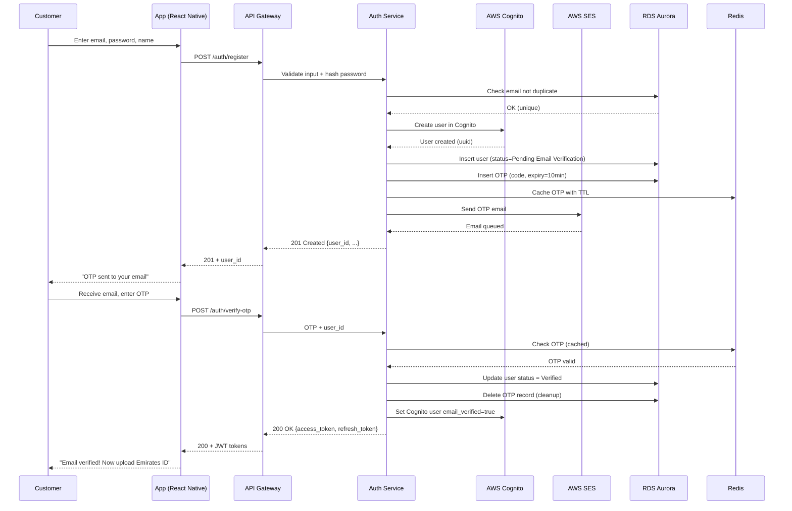
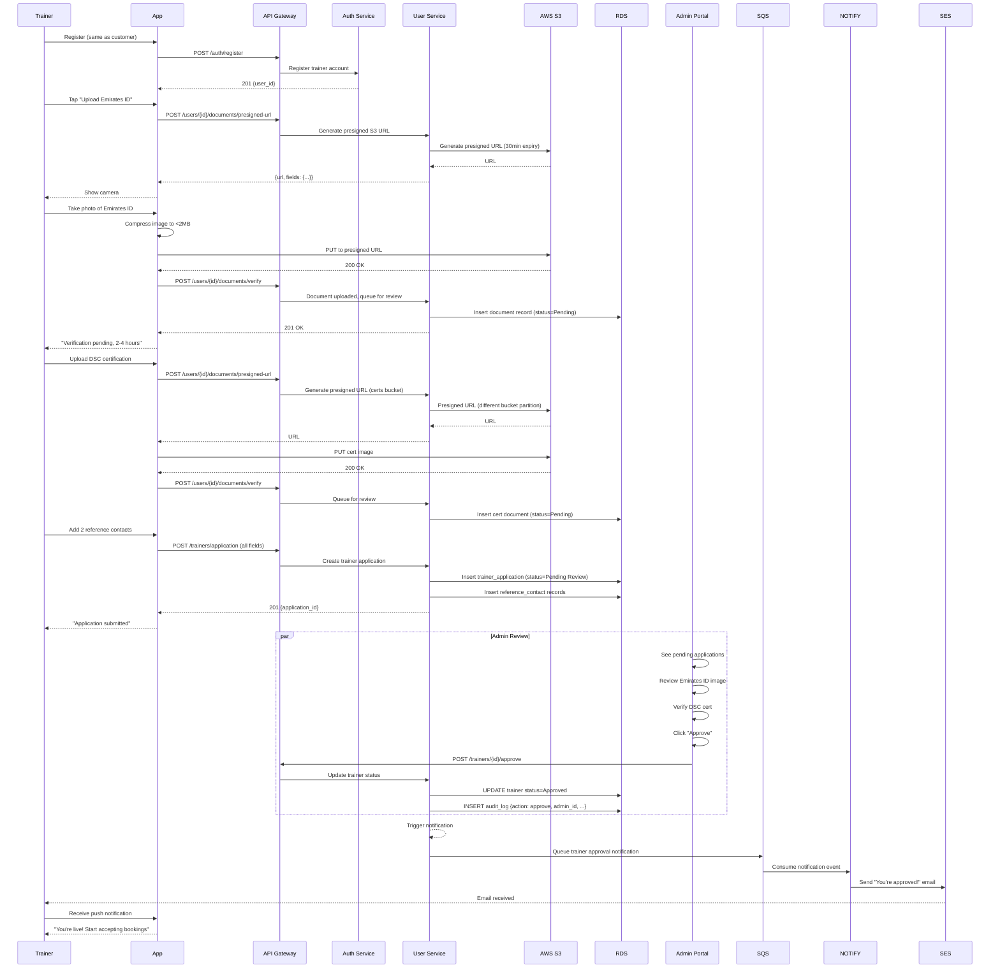
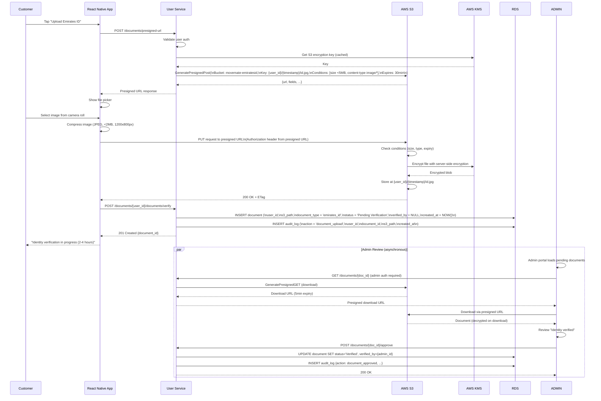
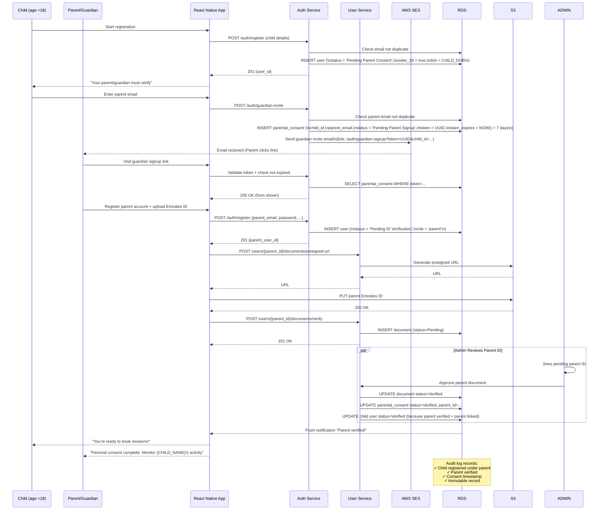

# Solution Architect — Definition Phase Deliverable
## Service Decomposition, Architecture Diagrams & Failure Modes for Foundation (Sprint 1–2)

**Phase:** Definition  
**Owner:** Solution Architect (🏛️)  
**Scope:** Foundation microservices — Auth, User, Notification (OTP), Document Upload  
**Sprint Timeline:** Weeks 1–4 of 12-week MVP  
**Primary Region:** AWS me-south-1 (Bahrain) — UAE data residency  
**Cost Target:** AED 2,200–3,500/month

---

## Executive Summary

The Foundation slice is built on **three core microservices**, deployed as containerised tasks on ECS Fargate, backed by RDS Aurora Serverless v2, S3, and Cognito. This architecture is deliberately minimalist: just enough to support user onboarding, identity verification, and admin approvals. 

**Design principles:**
- **Serverless-first:** Pay only for what you use; auto-scale to zero during off-hours
- **No single points of failure:** Every critical path has fallback; circuit breakers prevent cascading failures
- **Compliance by design:** Data residency, encryption, audit logging baked in from the start
- **Cost-optimized for launch:** Start cheap; scale affordably as traffic grows

---

## Microservices Decomposition

### Service 1: Auth Service
**Responsibility:** User registration, email/SMS OTP, login, JWT token management  
**Technology:** Node.js 20 LTS + Fastify + Prisma + Cognito  
**Deployment:** ECS Fargate (2 instances min, auto-scale to 5)  
**Database:** RDS Aurora PostgreSQL (shared with user-service; separate schema)  
**Cache:** ElastiCache Redis (session storage)

**Key Endpoints:**
```
POST   /auth/register              — Register new user (email/phone)
POST   /auth/send-otp              — Resend OTP (idempotent)
POST   /auth/verify-otp            — Verify OTP code
POST   /auth/login                 — Login with email + password
POST   /auth/refresh-token         — Refresh JWT
POST   /auth/logout                — Invalidate JWT
GET    /auth/me                    — Current user info (authenticated)
```

**Internal Dependencies:**
- Cognito: User pool creation, password validation (optional; can do locally)
- SES/Twilio: OTP delivery via email/SMS
- Redis: Session + refresh token storage
- RDS: User credentials, OTP records

**Failure Modes:**
- **Cognito unavailable:** Fall back to local password hashing (bcrypt); continue registrations
- **SES/Twilio unavailable:** Queue OTP for retry; alert on-call
- **Redis unavailable:** Write OTP to RDS with TTL; slower but functional

---

### Service 2: User Service
**Responsibility:** User profile management, document upload coordination, under-18 handling  
**Technology:** Node.js 20 LTS + Fastify + Prisma  
**Deployment:** ECS Fargate (2 instances min, auto-scale to 5)  
**Database:** RDS Aurora PostgreSQL (shared schema with auth-service)  
**Storage:** S3 for PII documents (Emirates ID, DSC certs)

**Key Endpoints:**
```
GET    /users/{id}                 — Fetch user profile
PATCH  /users/{id}                 — Update profile
POST   /users/{id}/documents/presigned-url  — Generate S3 presigned URL for upload
GET    /users/{id}/documents       — List user's documents
POST   /users/{id}/documents/verify — Trigger admin review of uploaded document
POST   /users/{id}/documents/{docId}/approve  — Admin approves document (admin-only)
POST   /users/{id}/documents/{docId}/reject   — Admin rejects document (admin-only)
POST   /users/{id}/parental-consent  — Create parental consent record (under-18)
GET    /users/{id}/parental-consent — Fetch parental consent (admin/parent)
```

**Internal Dependencies:**
- S3: Document upload/download (via presigned URLs)
- RDS: User data, document metadata, parental consent records
- Cognito: User identity validation (check user exists before operations)

**Failure Modes:**
- **S3 presigned URL generation fails:** Retry 3 times with exponential backoff; return 503 after retries
- **S3 upload fails:** Client retries; server logs failure; admin queue ignores until resubmitted
- **Parental consent record fails:** Transaction rolled back; user re-prompted to submit

---

### Service 3: Notification Service (OTP Only)
**Responsibility:** Send transactional emails (OTP, registration confirmation) and SMS OTP  
**Technology:** Node.js 20 LTS + Bull (Redis-backed job queue)  
**Deployment:** ECS Fargate (1 instance, auto-scale to 3)  
**Message Queue:** SQS (async notifications) + Bull/Redis (background jobs)

**Event-Driven Architecture:**
```
Auth Service → [SQS Queue: SendOTP] → Notification Service
             ↓
        [SNS Topic: OTPSent] → Subscribed systems (analytics, etc.)
```

**Key Operations:**
- **SendOTP:** Email via SES or SMS via Twilio (based on user preference)
- **SendRegistrationConfirmation:** Welcome email after successful registration
- **SendApprovalNotification:** Trainer/studio notified when application approved

**Internal Dependencies:**
- SQS: Async job queue
- SES: Email delivery (primary)
- Twilio: SMS delivery (primary)
- SNS: Fan-out to other subscribers (future analytics)

**Failure Modes:**
- **SES unavailable:** Fallback to Twilio SendGrid (Phase 2); queue jobs for retry
- **Twilio unavailable:** Fall back to SES (email instead of SMS); alert trainer to check email
- **SQS unavailable:** Circuit breaker; return error to auth service; user prompted to retry

---

## Architecture Diagrams (Mermaid)

### Component Diagram: Foundation System

```mermaid
graph TB
    subgraph "Client Layer"
        APP["📱 React Native App\n(iOS/Android)"]
        WEB["🌐 Web Browser"]
    end

    subgraph "CDN & Edge"
        CF["☁️ CloudFront CDN\n(static assets, videos)"]
    end

    subgraph "API Gateway & WAF"
        WAF["🔒 AWS WAF\n(DDoS, rate limiting)"]
        APIGW["🚪 API Gateway HTTP\n(REST + WebSocket)")
    end

    subgraph "Authentication"
        COGNITO["🔐 AWS Cognito\n(user pools, MFA)"]
    end

    subgraph "ECS Fargate - Microservices (Private VPC)"
        AUTH["🔑 Auth Service\n(register, OTP, login)"]
        USER["👤 User Service\n(profile, documents)"]
        NOTIFY["📬 Notification Service\n(email, SMS)"]
    end

    subgraph "Data Layer"
        RDS["🗄️ RDS Aurora Serverless v2\n(PostgreSQL)"]
        REDIS["⚡ ElastiCache Redis\n(sessions, cache)"]
        DYNODB["⚙️ DynamoDB\n(real-time state, Phase 2)"]
    end

    subgraph "Storage & Delivery"
        S3["📦 S3\n(Emirates ID, certs, videos)"]
        KMS["🔑 AWS KMS\n(encryption keys)"]
    end

    subgraph "Integration Services"
        SES["📧 AWS SES\n(email)"]
        TWILIO["📱 Twilio\n(SMS)"]
        SQS["📨 SQS\n(async queue)"]
        SNS["📢 SNS\n(pub/sub)"]
    end

    subgraph "Monitoring & Logging"
        CW["📊 CloudWatch\n(metrics, logs, alarms)"]
        XRAY["🔍 X-Ray\n(distributed tracing)"]
    end

    APP --> CF
    WEB --> CF
    APP --> WAF
    WEB --> WAF
    CF --> S3
    WAF --> APIGW
    APIGW --> COGNITO
    APIGW --> AUTH
    APIGW --> USER
    APIGW --> NOTIFY
    
    AUTH --> RDS
    AUTH --> REDIS
    AUTH --> SES
    AUTH --> TWILIO
    AUTH --> SQS
    
    USER --> RDS
    USER --> S3
    USER --> KMS
    
    NOTIFY --> SQS
    NOTIFY --> REDIS
    NOTIFY --> SES
    NOTIFY --> TWILIO
    NOTIFY --> SNS
    
    RDS --> KMS
    S3 --> KMS
    
    AUTH --> CW
    USER --> CW
    NOTIFY --> CW
    AUTH --> XRAY
    USER --> XRAY
    NOTIFY --> XRAY
```

### Sequence Diagram: Customer Registration Flow



### Sequence Diagram: Trainer Registration with DSC Certification



### Sequence Diagram: Emirates ID Upload with Presigned URL



### Sequence Diagram: Under-18 Parental Consent



---

## Inter-Service Communication

### Synchronous (REST)

- **Client → Auth Service:** Registration, login, OTP verification (direct HTTP)
- **Client → User Service:** Profile updates, document presigned URL requests (direct HTTP)
- **Client → Admin Service:** Trainer approvals, document reviews (admin-only, authenticated)

**Error Handling:**
- Timeout: 10 seconds per request; client-side retry with exponential backoff (1s, 2s, 4s)
- Non-200 response: propagate error to user with friendly message
- Circuit breaker: if service unreachable >5 times in 60s, return 503 for 30s before re-testing

### Asynchronous (Event-Driven)

```
Auth Service → [SQS Queue] → Notification Service
              [SendOTP event: {user_id, phone, otp_code, type: sms|email}]

User Service → [SNS Topic] → Multiple subscribers
             [DocumentVerified event: {doc_id, status, reviewer_id}]

User Service → [SQS Queue] → Notification Service
             [TrainerApproved event: {trainer_id, approval_timestamp}]
```

**Message Format:**
```json
{
  "event_id": "evt-uuid-123",
  "event_type": "SendOTP",
  "timestamp": "2026-05-03T10:00:00Z",
  "data": {
    "user_id": "user-uuid-456",
    "phone": "+971501234567",
    "otp_code": "123456",
    "language": "en"
  }
}
```

**Idempotency:** Every event has `event_id`; consumers track processed events to prevent duplicate sends (e.g., OTP sent twice if message processed twice).

---

## Failure Modes & Recovery Strategies

### Failure Mode 1: Presigned S3 URL Expires During Upload
**Scenario:** User starts upload, network drops for 30+ minutes, tries to resume  
**Impact:** Upload fails; user frustrated  
**Recovery:**
1. Client detects 403 Forbidden (expired URL)
2. User taps "Retry"
3. App requests new presigned URL
4. S3 preserves partial upload (multipart upload); resume from offset
5. If resume not supported, fallback to full re-upload

**Prevention:**
- Generate presigned URLs with 60-minute expiry (not 30 minutes) for slow networks
- Implement S3 multipart upload with resume support
- Test upload resumption in QA (simulate network interruption at 50%, 90%)

---

### Failure Mode 2: OTP Brute Force Attack
**Scenario:** Attacker tries 10,000 OTP codes to guess a 6-digit code  
**Impact:** Account takeover risk  
**Prevention:**
1. Rate limit: max 10 OTP verification attempts per phone in 1 hour
2. Lock account after 10 failed attempts; require email reset link
3. Log all failed attempts in audit log
4. Alert if 5+ failed attempts on same account within 10 minutes

**Recovery:**
- User locked account → receives email "Reset your account"
- Click reset link → new OTP sent to registered phone
- Verify new OTP → account unlocked

---

### Failure Mode 3: Cognito User Pool Unavailable
**Scenario:** AWS Cognito service degraded or down (rare, but possible)  
**Impact:** Registration and login fail  
**Fallback:**
1. **Phase 1 (Foundation):** Auth service can fall back to local password validation (bcrypt) for critical operations
2. **Locally issued JWT:** If Cognito unavailable, auth service issues JWT directly using private key (cached public key rotation)
3. **Queue registrations:** If Cognito unavailable >30 seconds, queue registrations for later sync
4. **Time limit:** Run in degraded mode max 2 hours; require manual migration to Cognito before resuming

**Prevention:**
- Cache Cognito public keys locally (30-minute TTL) for offline JWT validation
- Circuit breaker: if Cognito fails 5 times in 60s, switch to degraded mode
- Alert on-call immediately when degraded mode activated

---

### Failure Mode 4: S3 Bucket Quota Exceeded
**Scenario:** Team misconfigures S3 quota; new uploads fail  
**Impact:** Customers cannot upload Emirates ID; onboarding blocked  
**Prevention:**
1. Set S3 quota high (1TB) relative to expected usage (10GB/month)
2. Implement CloudWatch alarm: alert if bucket size >500GB (80% of quota)
3. S3 Intelligent Tiering: move documents older than 30 days to cheaper storage tier
4. Implement quotas per user: max 100MB per customer to prevent abuse

**Recovery:**
- Alert triggered → DevOps increases quota or archives old documents
- During outage: return 503 "Service temporarily unavailable" with retry guidance
- Communicate ETA to customers (email + in-app notification)

---

### Failure Mode 5: Redis Cache Loss (Node Crash)
**Scenario:** ElastiCache Redis node fails; all cached sessions lost  
**Impact:** All users logged out; forced re-login  
**Prevention:**
1. ElastiCache Multi-AZ: 2 nodes (primary + replica) in different AZs
2. Automatic failover: replica promoted to primary within 30 seconds
3. RDS fallback: if Redis unavailable, auth service falls back to reading sessions from RDS (slower but functional)

**Recovery:**
- Automatic: Redis failover handles transparently
- If both nodes down: users receive 503 "Please log in again"; re-authenticate via OTP

---

### Failure Mode 6: Database Connection Pool Exhaustion
**Scenario:** Traffic spike; all 100 RDS connections occupied; new requests queue up  
**Impact:** API latency spikes; some requests timeout  
**Prevention:**
1. **ECS auto-scaling:** when ECS CPU >70% for 2 minutes, scale up (add more instances)
2. **Connection pooling:** each ECS instance runs PgBouncer (proxy) with max 20 connections per instance
3. **Query optimization:** ensure all queries use indexes; monitor slow query log
4. **Aurora Serverless:** auto-scales database capacity (ACUs) based on load

**Recovery:**
- Automatic scaling: new ECS instances spawned within 2 minutes
- Circuit breaker: if connection pool full 3 times in 60s, return 503 and trigger scaling
- Manual escalation: on-call checks database metrics; may need to kill idle connections

---

### Failure Mode 7: Document Upload Fails, User Loses Progress
**Scenario:** User uploads 5MB video; S3 returns 503; no retry  
**Impact:** User must re-record video; frustration  
**Prevention:**
1. **Client-side retry:** app automatically retries S3 upload 3 times with exponential backoff
2. **Resume support:** S3 multipart upload with resume capability
3. **Local cache:** app caches selected file locally; persists across app restarts
4. **Timeout handling:** if upload >5 minutes, pause and ask user "Retry?"

**Recovery:**
- User taps "Retry" → app resumes from last successful multipart chunk
- If resume fails: full re-upload required (last resort)

---

## Cost Estimation (Foundation Phase)

**Monthly AWS Cost: AED 2,200–3,500 (estimated)**

### Cost Breakdown

| Service | Usage | Cost |
|---------|-------|------|
| **RDS Aurora Serverless v2** | 10–50 ACUs, avg 20; 50GB storage | AED 800–1,200 |
| **ECS Fargate** | 3 services × 2 instances avg; 0.5 vCPU each; 1GB RAM | AED 350–500 |
| **ElastiCache Redis** | cache.t3.micro (0.5GB) Multi-AZ | AED 250–350 |
| **S3 Storage** | 10GB storage; 1000 PUT, 10000 GET per day | AED 100–150 |
| **CloudFront CDN** | 100GB egress/month | AED 50–100 |
| **API Gateway HTTP** | 100M requests/month | AED 200–300 |
| **SQS** | 1000 messages/day | AED 10–20 |
| **SNS** | 500 notifications/day | AED 5–10 |
| **SES** | 10000 emails/month | AED 10–20 |
| **Twilio SMS** | 1000 OTPs/month | AED 100–150 |
| **KMS** | 10000 requests/month | AED 20–30 |
| **CloudWatch Logs** | 100GB/month | AED 50–100 |
| **Data Transfer** | 1TB/month outbound | AED 200–300 |
| **Backup & DLM** | RDS snapshots + S3 backup | AED 50–100 |
| **Miscellaneous** | NAT Gateway, Secrets Manager, etc. | AED 50–100 |

**Total: AED 2,245–3,430/month**

### Cost Optimization

1. **Aurora Serverless v2:** scales to 0 ACUs during off-hours (midnight–6am) → saves ~60% vs provisioned
2. **ECS Fargate Spot (non-critical services):** use Spot instances for notification service → 70% savings
3. **S3 Intelligent Tiering:** move documents >30 days old to Glacier → 90% storage savings
4. **API Gateway HTTP API:** 71% cheaper than REST API type for same throughput
5. **Reserved capacity (Phase 2):** 1-year RDS + ECS Savings Plans reduce costs by 40% after launch

---

## Deployment & Infrastructure as Code

### AWS CDK Structure

```
infrastructure/
├── lib/
│   ├── vpc-stack.ts              — VPC, subnets, NAT Gateway
│   ├── rds-stack.ts              — Aurora Serverless + backup policy
│   ├── elasticache-stack.ts      — Redis cluster + security group
│   ├── s3-stack.ts               — Document buckets + encryption + lifecycle
│   ├── ecs-stack.ts              — ECS cluster + service definitions
│   ├── auth-service-stack.ts     — Auth service task definition + auto-scaling
│   ├── user-service-stack.ts     — User service task definition
│   ├── notification-stack.ts     — Notification service + SQS queue
│   ├── cognito-stack.ts          — Cognito user pool + client app
│   ├── monitoring-stack.ts       — CloudWatch dashboards + alarms
│   └── main-stack.ts             — Orchestrate all stacks
├── bin/
│   └── app.ts                    — Entry point
└── package.json
```

**Deploy with:**
```bash
cdk deploy --all --region me-south-1 --profile movemate-prod
```

### Database Migrations

```bash
# In each microservice repo:
npx prisma migrate deploy --preview-feature
```

---

## Sign-Off & Approval

**Architecture Review:**
- [ ] Tech Lead Backend — service boundaries clear; inter-service communication patterns approved
- [ ] DevOps — infrastructure scalable; monitoring/alerting in place
- [ ] Security — encryption, network segmentation, IAM policies reviewed
- [ ] Product Owner — architecture supports all Foundation user stories

---

**Document Version:** 1.0  
**Last Updated:** 2026-05-03  
**Next Review:** Week 2 of Sprint 1 (infrastructure deployed to staging)  
**Approval:** Pending Tech Lead & Architecture review
